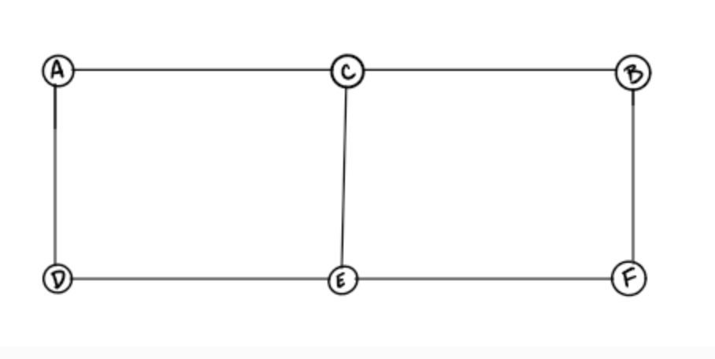
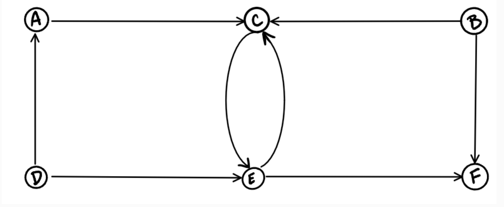
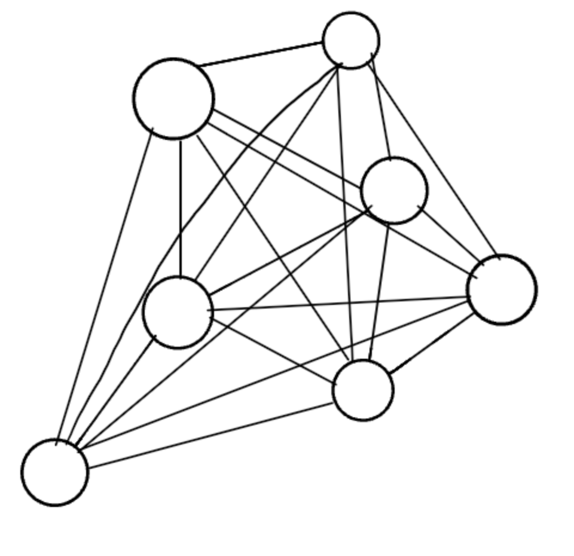
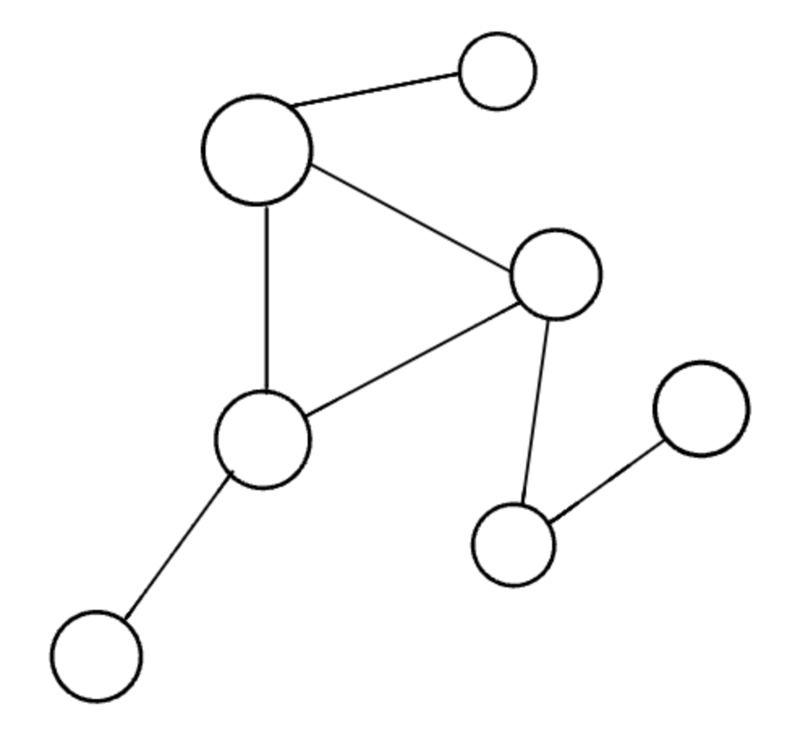
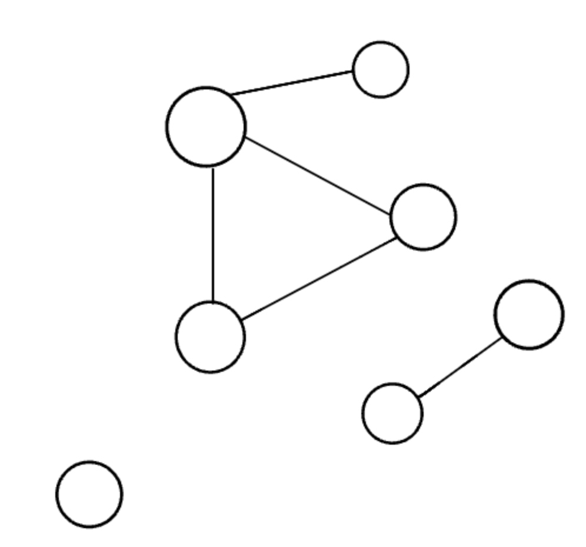
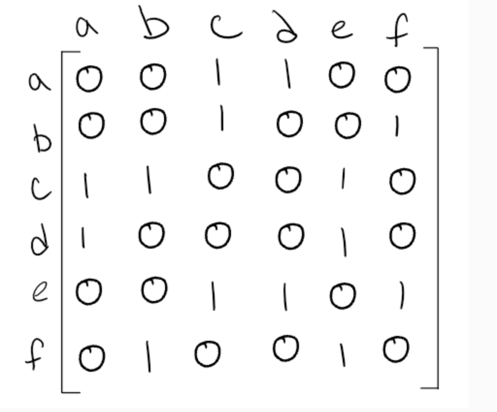
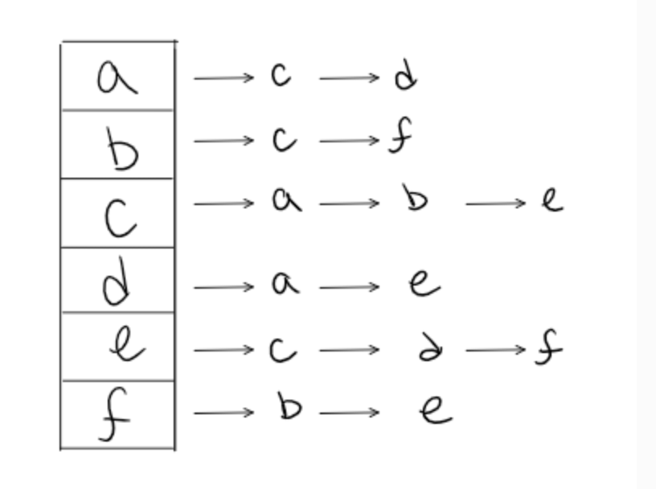
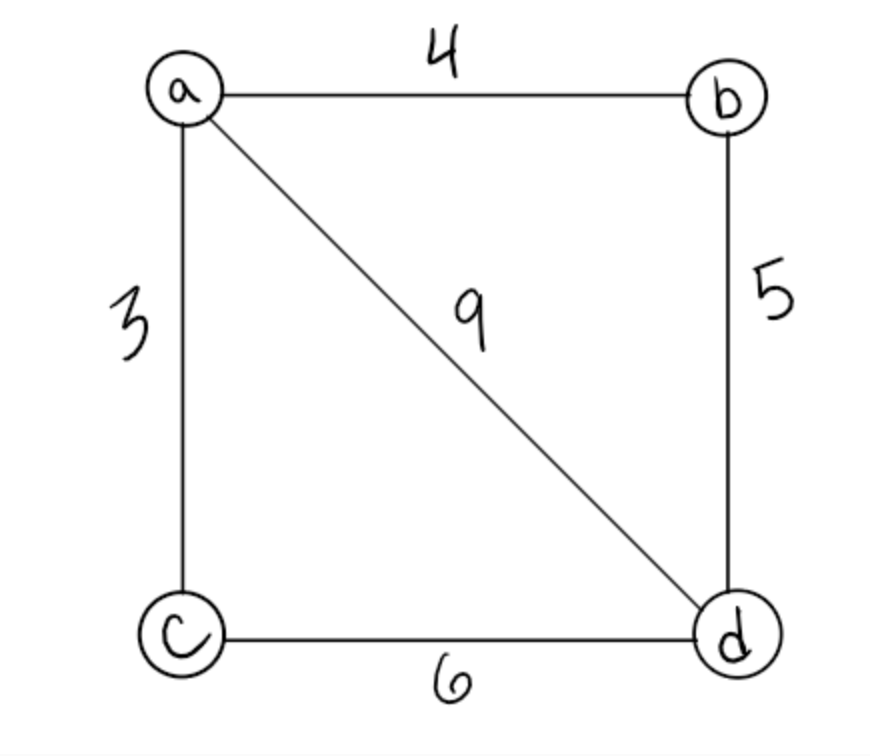
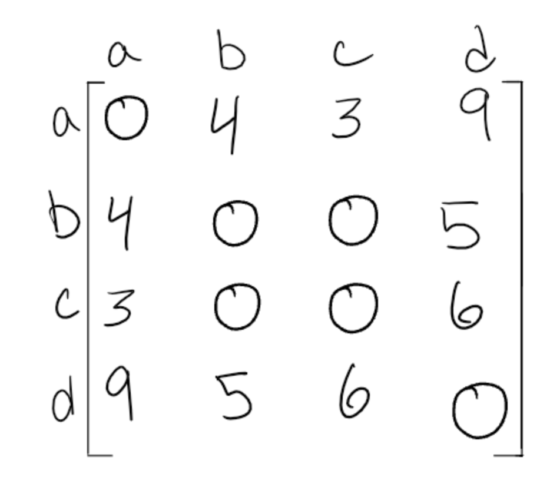
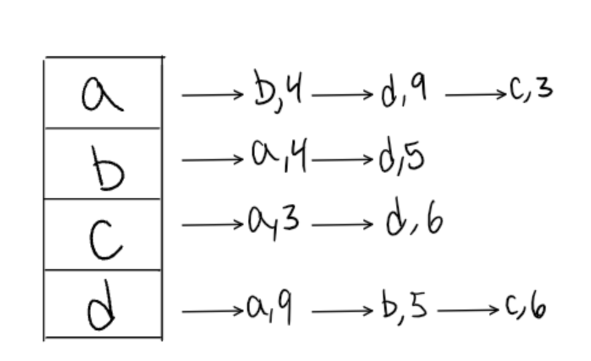

# Day 35 Reading Notes --> Graphs

## Reading
* [Graphs](https://codefellows.github.io/common_curriculum/data_structures_and_algorithms/Code_401/class-35/resources/graphs.html)

  * A ***Graph*** is a non-linear data structure that can be looked at as a collection of `vertices` or `Nodes` 
    potentially connected by line segments called `edges`.
  * Terminology:
    * **Vertex:** aka a `node`, is an object that can have zero or more adjacent vertices.
    * **Edge:** a connection between 2 nodes.
    * **Neighbor:** the adjacent nodes connected via an edge.
    * **Degree:** the number of edges connected to a vertex.
  * `Undirected` vs `Directed`
    * `Undirected Graphs` are where each edge is bidirectional.
    
      * This undirected graph is bidirectional due to the lack of directions pointing to vertices.
      * This graph has 6 vertices and 7 undirected edges
      * Vertices/Nodes --> {a, b, c, d, e, f}
      * Edges --> [(a, c), (a, d), (b, c), (b, f), (c, e), (d, e), (e, f)]
    * `Directed Graphs` aka a `Digraph` is where every edge has direction.
      * Each node is directed to another node with a specific requirement of what should be references next.
      
        * This graph has 6 vertices and 8 directed edges
        * Vertices --> {a, b, c, d, e, f}
        * Edges --> {(a, c), (b, c), (b, f), (c, e), (d, a), (d, e), (e, c), (e, f)}
  * `Complete` vs `Connected` vs `Disconnected`
    * A `Complete` graph is where all nodes are connected to all other nodes.
    
    * A `Connected` graph is where all the vertices/nodes have at least 1 edge.
    
    * A `Disonnceted` graph is where some vertices may not have edges.
    
  * Graph Representation
    * Graphs are represented through:
    * Using the model below, we will represent the graph using:
      
    * **Adjacency Matrix:** represented through a 2-D array. If there are n vertices then, we are looking at 
    ***n*** x ***n*** Boolean matrix.
    
      * Each row and column represents each vertex of the data structure.The elements of both the column and the row 
        must add up to 1 IF there is an edge that connects them otherwise, a zero  if there are no connections 
        between the 2 vertices.
      * A graph is ***sparse*** if there are few connections
      * A graph is ***dense*** if there are many connections
    * **Adjacency List**
    
      * An undirected graph will always be symmetrical however, that is not necessarily the case for a directed graph.
      * Most common method for representing a graph.
      * An adjacency list is a collection of linked lists or array that lists all the vertices that are connected.
    * A `Weighted` graph is a graph with numbers assigned to the edges.
    
    * A weighted graph as a matrix representation:
    
    * A weighted graph as an adjacency list:
    
  * Way to traverse a graph:
    * Breadth First
    * Depth First