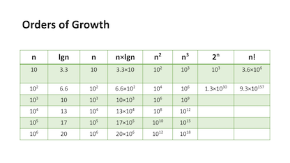

# Day 5

## Understanding the Big O: Analysis of Algorithm Efficiency

Big O is a way to describe the worst case of efficiency an algorithm
can have in performing its job.

### 4 Key Areas

1. Input Size

- Represented by `O(n)`
- Refers to the size of the parameter values read by the algorithm.
- The size takes into account not just the number of parameters but, also the size of each parameter.
- The higher this number, the load on the ***Running Time*** and ***Memory Space*** are increased

2. Units of Measurement

- 3 Measurements of time:
  1. Milliseconds: from start to finish the abount of time it takes a function to execute
  2. Operations: refers to the number of lines that are executed from start to finish
  3. Basic Operations: refers to the operation that contributes the most to the total running time.

- 4 Sources of memory usage:
  1. Code for the algorithm: think in terms of the number of bytes needed to store the charachters for the function instructions.
  2. Input data: this refers to the amount of space needed to hold the input data
  3. Output data: this refers to the amount of space needed to hold the output data
  4. Working space: think of this as the creation of variables and reference points needed to perform. This includes ***stack space*** for recursive calls.

3. Orders of Growth

This refers to the increase in Running Time or Memory Space.

4. Best Case, Worst Case, and Average Case
